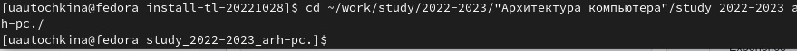
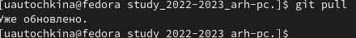
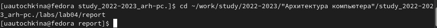
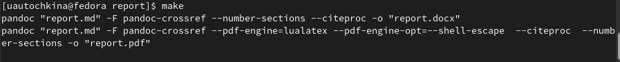
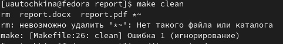
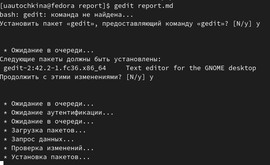
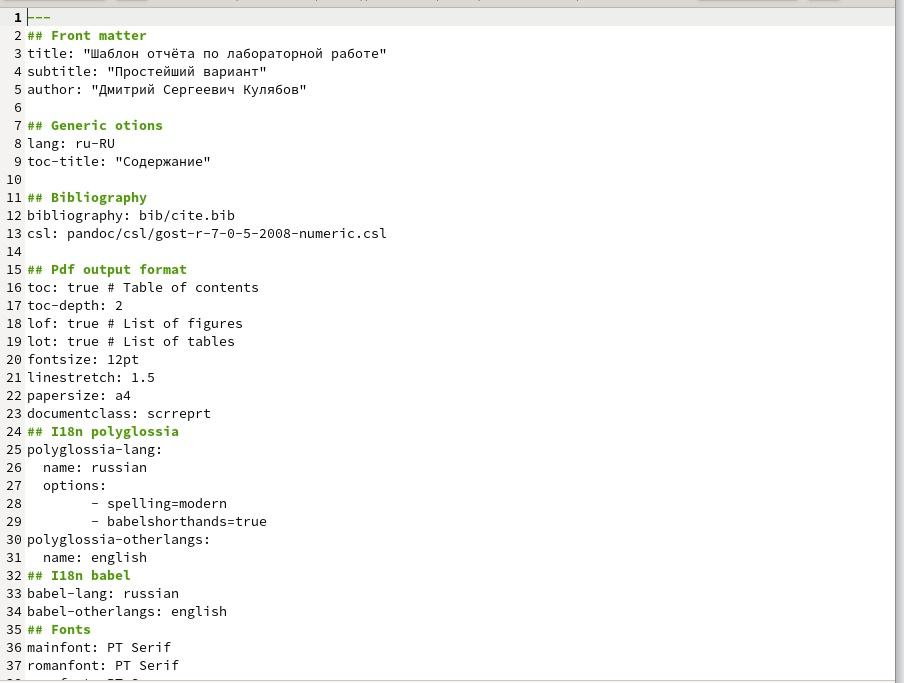
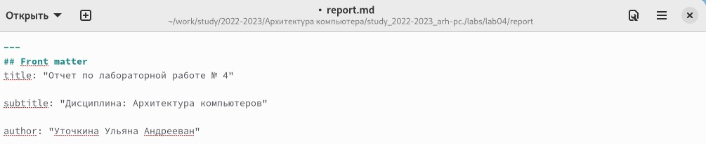
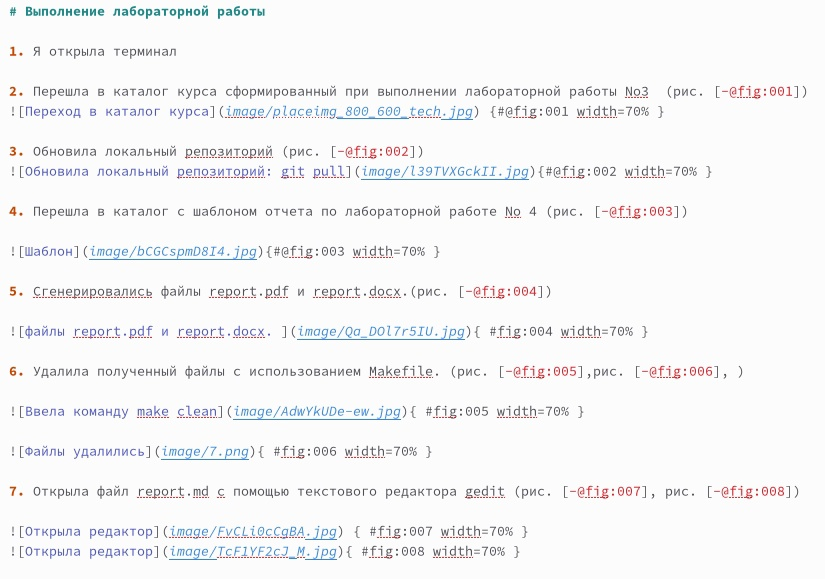

---
## Front matter
title: "Отчет по лабораторной работе № 4"

subtitle: "Дисциплина: Архитектура компьютеров"

author: "Уточкина Ульяна Андрееван"

## Generic otions
lang: ru-RU
toc-title: "Содержание"

## Bibliography
bibliography: bib/cite.bib
csl: pandoc/csl/gost-r-7-0-5-2008-numeric.csl

## Pdf output format
toc: true # Table of contents
toc-depth: 2
lof: true # List of figures
lot: true # List of tables
fontsize: 12pt
linestretch: 1.5
papersize: a4
documentclass: scrreprt
## I18n polyglossia
polyglossia-lang:
  name: russian
  options:
	- spelling=modern
	- babelshorthands=true
polyglossia-otherlangs:
  name: english
## I18n babel
babel-lang: russian
babel-otherlangs: english
## Fonts
mainfont: PT Serif
romanfont: PT Serif
sansfont: PT Sans
monofont: PT Mono
mainfontoptions: Ligatures=TeX
romanfontoptions: Ligatures=TeX
sansfontoptions: Ligatures=TeX,Scale=MatchLowercase
monofontoptions: Scale=MatchLowercase,Scale=0.9
## Biblatex
biblatex: true
biblio-style: "gost-numeric"
biblatexoptions:
  - parentracker=true
  - backend=biber
  - hyperref=auto
  - language=auto
  - autolang=other*
  - citestyle=gost-numeric
## Pandoc-crossref LaTeX customization
figureTitle: "Рис."
tableTitle: "Таблица"
listingTitle: "Листинг"
lofTitle: "Список иллюстраций"
lotTitle: "Список таблиц"
lolTitle: "Листинги"
## Misc options
indent: true
header-includes:
  - \usepackage{indentfirst}
  - \usepackage{float} # keep figures where there are in the text
  - \floatplacement{figure}{H} # keep figures where there are in the text
---

# Цель работы

Освоение процедуры оформления отчетов с помощью легковесного языка разметки Markdown.

# Задание

Изучить легковестный язык разметки Markdown

# Теоретическое введение

Чтобы создать заголовок, используйте знак #, например: #This is heading 1

Чтобы задать для текста полужирное начертание, заключите его в двойные

звездочки: This text is **bold**

Чтобы задать для текста курсивное начертание, заключите его в одинарные

звездочки:

This text is *italic*.

Чтобы задать для текста полужирное и курсивное начертание, заключите его

в тройные звездочки: ***labs***

# Выполнение лабораторной работы

1. Я открыла терминал

2. Перешла в каталог курса сформированный при выполнении лабораторной работы No3  (рис. [-@fig:001])

 {#@fig:001 width=70% }

3. Обновила локальный репозиторий (рис. [-@fig:002])

{#@fig:002 width=70% }

4. Перешла в каталог с шаблоном отчета по лабораторной работе No 4 (рис. [-@fig:003])

{#@fig:003 width=70% }

5. Сгенерировались файлы report.pdf и report.docx.(рис. [-@fig:004])

{ #fig:004 width=70% }

6. Удалила полученный файлы с использованием Makefile. (рис. [-@fig:005],рис. [-@fig:006], )

{ #fig:005 width=70% } 

{ #fig:006 width=70% } 

7. Открыла файл report.md c помощью текстового редактора gedit (рис. [-@fig:007], рис. [-@fig:008])

 { #fig:007 width=70% } 

{ #fig:008 width=70% } 

8. Заполнила отчет и скомпилировала отчет с использованием Makefile. (рис. [-@fig:009], рис. [-@fig:010],  рис. [-@fig:011])

{ #fig:009 width=70% }

{ #fig:010 width=70% }

{ #fig:011 width=70% }

9. Загрузила файлы на Github.(рис. [-@fig:012], рис. [-@fig:013] )

{ #fig:012 width=70% }

{ #fig:013 width=70% }

# Выводы

Научилась делать отчеты в Markdown

# Список литературы{.unnumbered}

::: {#refs}
:::
