---
## Front matter
title: "Отчёт по лабораторной работе № 9"
subtitle: "Архитектура компьютера"
author: "Уточкина Ульяна Андреевна"

## Generic otions
lang: ru-RU
toc-title: "Содержание"

## Bibliography
bibliography: bib/cite.bib
csl: pandoc/csl/gost-r-7-0-5-2008-numeric.csl

## Pdf output format
toc: true # Table of contents
toc-depth: 2
lof: true # List of figures
fontsize: 12pt
linestretch: 1.5
papersize: a4
documentclass: scrreprt
## I18n polyglossia
polyglossia-lang:
  name: russian
  options:
	- spelling=modern
	- babelshorthands=true
polyglossia-otherlangs:
  name: english
## I18n babel
babel-lang: russian
babel-otherlangs: english
## Fonts
mainfont: PT Serif
romanfont: PT Serif
sansfont: PT Sans
monofont: PT Mono
mainfontoptions: Ligatures=TeX
romanfontoptions: Ligatures=TeX
sansfontoptions: Ligatures=TeX,Scale=MatchLowercase
monofontoptions: Scale=MatchLowercase,Scale=0.9
## Biblatex
biblatex: true
biblio-style: "gost-numeric"
biblatexoptions:
  - parentracker=true
  - backend=biber
  - hyperref=auto
  - language=auto
  - autolang=other*
  - citestyle=gost-numeric
## Pandoc-crossref LaTeX customization
figureTitle: "Рис."
tableTitle: "Таблица"
listingTitle: "Листинг"
lofTitle: "Список иллюстраций"
lolTitle: "Листинги"
## Misc options
indent: true
header-includes:
  - \usepackage{indentfirst}
  - \usepackage{float} # keep figures where there are in the text
  - \floatplacement{figure}{H} # keep figures where there are in the text
---

# Цель работы

Приобретение навыков написания программ с использованием циклов и
обработкой аргументов командной строки.

# Задание
1. Реализацовать циклы в NASM
2. Выполнить обработку аргументов командной строки
3. Выполнить задание для самостоятельной работы

# Выполнение лабораторной работы

## Реализация циклов в NASM

Создали каталог для программам лабораторной работы № 9, перейшли в
него и создали файл lab9-1.asm: (рис. [-@fig:001])

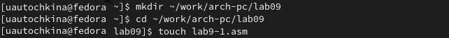{ #fig:001 width=70% }

При реализации циклов в NASM с использованием инструкции loop необходимо помнить о том, что эта инструкция использует регистр ecx в качестве
счетчика и на каждом шаге уменьшает его значение на единицу. В качестве
примера рассмотрели программу, которая выводит значение регистра ecx. Внимательно изучили текст программы (Листинг 9.1).

Ввели в файл lab9-1.asm текст программы из листинга 9.1. (рис. [-@fig:002]) Создали исполняемый файл и проверили его работу. (рис. [-@fig:003])

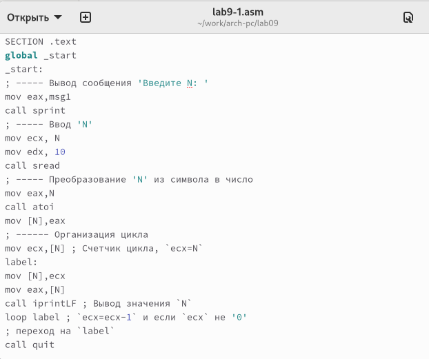{ #fig:002 width=70% }

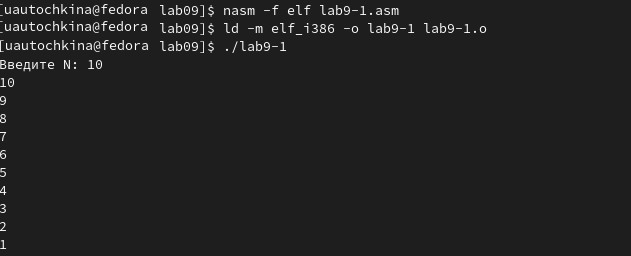{ #fig:003 width=70% }

Данный пример показывает, что использование регистра ecx в теле цилка
loop может привести к некорректной работе программы. Изменили текст программы добавив изменение значения регистра ecx в цикле: (рис. [-@fig:004])

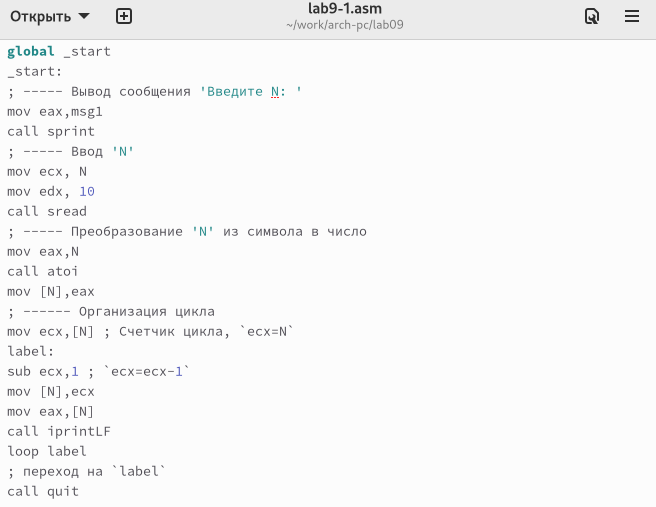{ #fig:004 width=70% }

Создали исполняемый файл и проверили его работу. (рис. [-@fig:005])
Регистр ecx принимает следующие значения в цикле: (рис. [-@fig:006]). Число проходов цикла не соответствует значению N введенному с клавиатуры.

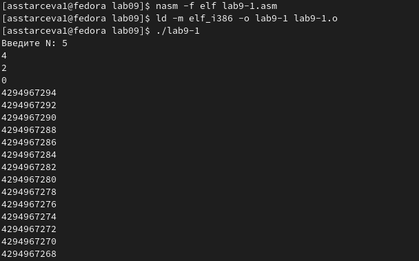{ #fig:005 width=70% }

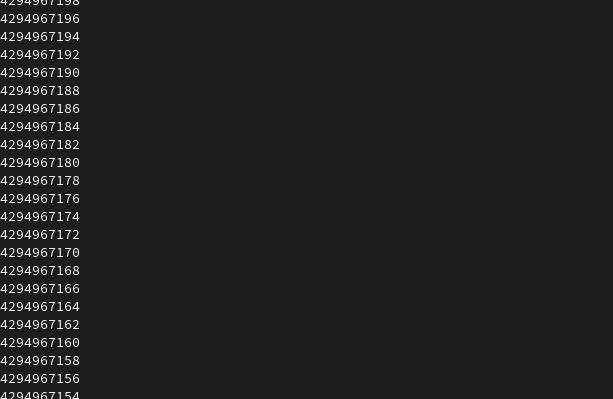{ #fig:006 width=70% }

Для использования регистра ecx в цикле и сохранения корректности работы
программы можно использовать стек. Внесли изменения в текст программы
добавив команды push и pop (добавления в стек и извлечения из стека) для
сохранения значения счетчика цикла loop: (рис. [-@fig:007])

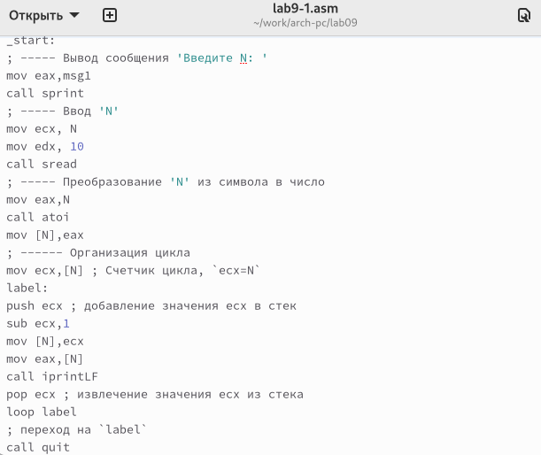{ #fig:007 width=70% }

Создали исполняемый файл и проверили его работу. (рис. [-@fig:008]) В данном случае число проходов цикла соответствует значению N введенному с клавиатуры.

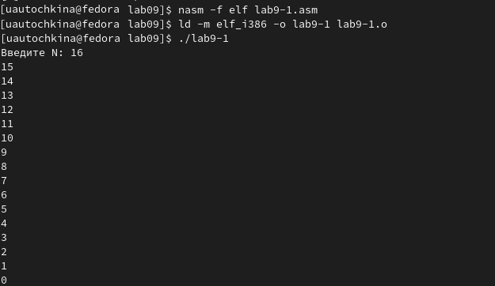{ #fig:008 width=70% }

## Обработка аргументов командной строки

При разработке программ иногда встает необходимость указывать аргументы,
которые будут использоваться в программе, непосредственно из командной
строки при запуске программы.
При запуске программы в NASM аргументы командной строки загружаются
в стек в обратном порядке, кроме того в стек записывается имя программы и
общее количество аргументов. Последние два элемента стека для программы,
скомпилированной NASM, – это всегда имя программы и количество переданных аргументов.
Таким образом, для того чтобы использовать аргументы в программе, их просто нужно извлечь из стека. Обработку аргументов нужно проводить в цикле.
Т.е. сначала нужно извлечь из стека количество аргументов, а затем циклично
для каждого аргумента выполнить логику программы. В качестве примера рассмотрели программу, которая выводит на экран аргументы командной строки.
Внимательно изучили текст программы (Листинг 9.2).

Создали файл lab9-2.asm в каталоге ~/work/arch-pc/lab09 и ввели в него
текст программы из листинга 9.2. (рис. [-@fig:009]), (рис. [-@fig:010]) 
Создали исполняемый файл и запустили его, указав аргументы: (рис. [-@fig:011]) 

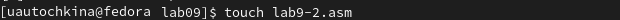{ #fig:009 width=70% }

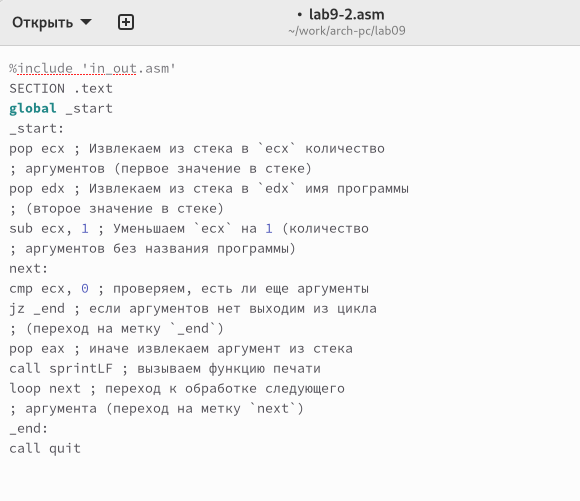{ #fig:010 width=70% }

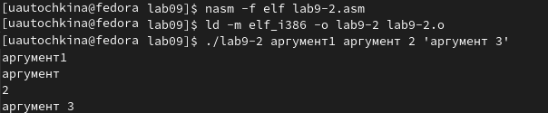{ #fig:011 width=70% }

Четыре аргумента было обработано программой.
Рассмотрели еще один пример программы, которая выводит сумму чисел,
которые передаются в программу как аргументы. Создали файл lab9-3.asm в каталоге ~/work/arch-pc/lab09 и ввели в него текст программы из листинга 9.3. (рис. [-@fig:012]), (рис. [-@fig:013])

{ #fig:012 width=70% }

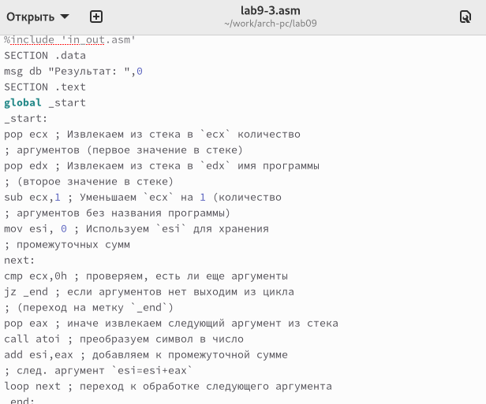{ #fig:013 width=70% }

Создали исполняемый файл и запустили его, указав аргументы. (рис. [-@fig:014])

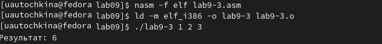{ #fig:014 width=70% }

Изменили текст программы из листинга 9.3 для вычисления произведения
аргументов командной строки. (рис. [-@fig:015]), (рис. [-@fig:016])

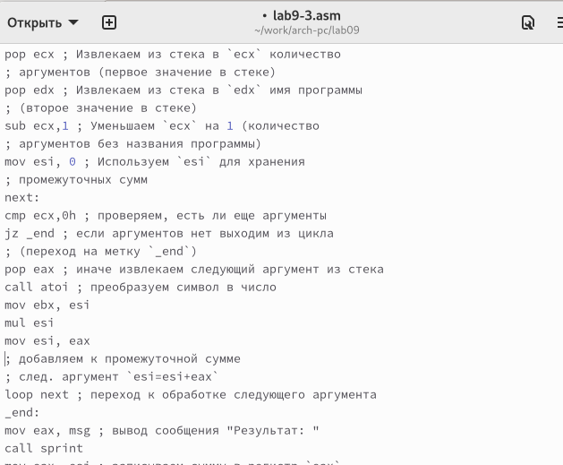{ #fig:015 width=70% }

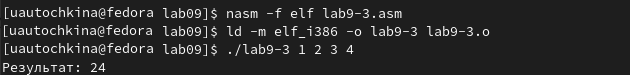{ #fig:016 width=70% }

## Задание для самостоятельной работы

Написали программу, которая находит сумму значений функции f(x)
для x = x1, x2, ..., xn т.е. программа должна выводить значение f(x1) + f(x2) + ... + f(xn). Значения xi передаются как аргументы. Вид функции f(x)
выбраkb из таблицы 9.1 вариантов заданий в соответствии с вариантом 17, полученным при выполнении лабораторной работы № 7. Создали исполняемый файл и проверили его работу на нескольких наборах. (рис. [-@fig:017]), (рис. [-@fig:018])

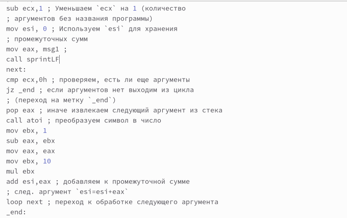{ #fig:017 width=70% }

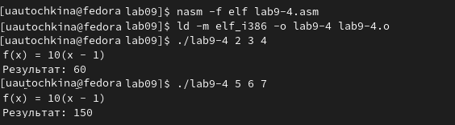{ #fig:018 width=70% }

# Выводы

В ходе выполнения лабораторной работы были приобретены навыки написания программ с использованием циклов и обработкой аргументов командной строки.

::: {#refs}
:::
